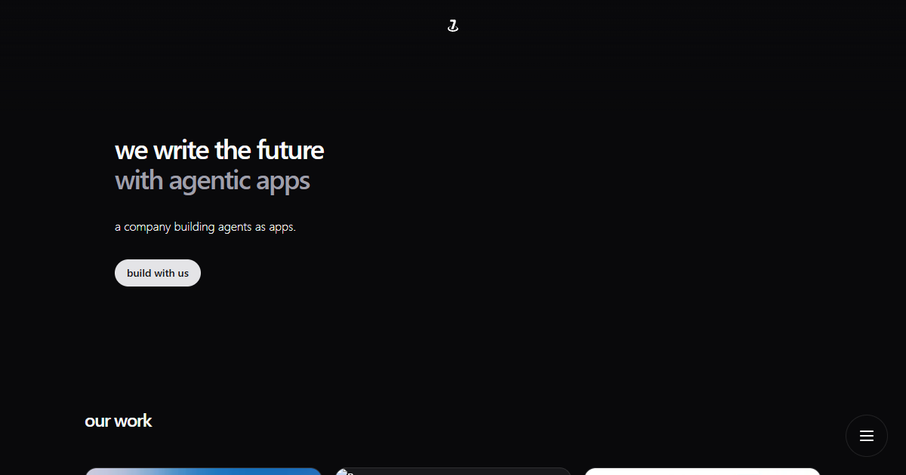

<table width="100%">
  <tr>
    <td align="center" width="120">
      
    </td>
    <td align="right">
      <h1>Base 7</h1>
      <h3 style="margin-top: -10px;">We shape the future with software</h3>
    </td>
  </tr>
</table>



### Local Development

1. Clone the repository

   ```bash
   git clone https://github.com/jiaweing/base7-landing.git
   cd base7-landing
   ```

2. Install dependencies

   ```bash
   bun install
   ```

3. Start the development server

   ```bash
   bun dev
   ```
